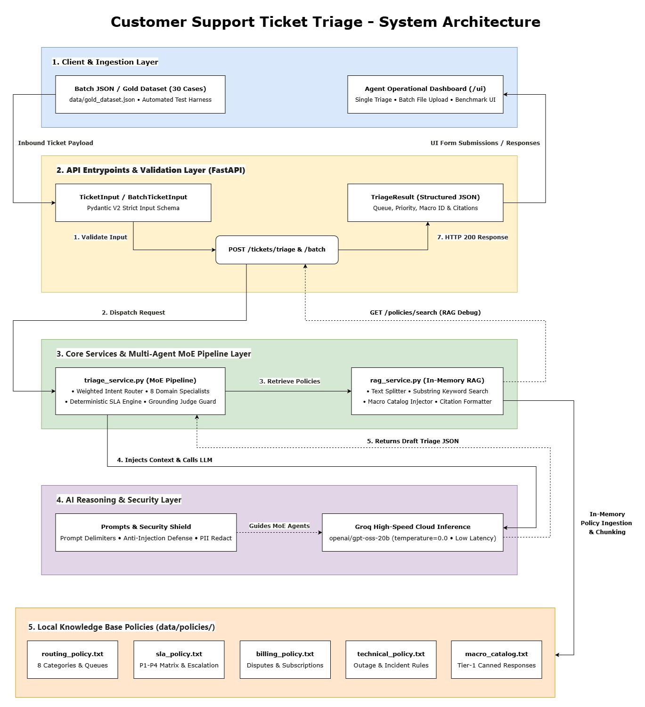

# Customer Support Ticket Triage

Customer Support Ticket Triage is an AI-powered backend service designed to classify customer support tickets, retrieve relevant Knowledge Base policies, and generate structured triage responses.

This release delivers an asynchronous multi-agent backend API utilizing Google Gemini (`gemini-3.6-flash`), domain-specific specialist agents, parallel batch execution, and Retrieval-Augmented Generation (RAG) policy grounding.

## Table of Contents

- [Overview](#overview)
- [Architecture](#architecture)
- [Features](#features)
- [Project Structure](#project-structure)
- [Workflow](#workflow)
- [Environment Configuration](#environment-configuration)
- [Repository Hygiene](#repository-hygiene)
- [Routing & Triage Design](#routing--triage-design)
- [API Endpoints](#api-endpoints)
- [Evaluation Benchmark](#evaluation-benchmark)
- [Sample Requests & Responses](#sample-requests--responses)
- [Running the Project](#running-the-project)
- [Current Limitations](#current-limitations)
- [Version](#version)
- [Authors](#authors)

# Overview

The system is designed as a modular backend utilizing Gemini LLM reasoning, Mixture-of-Experts (MoE) specialist agent routing, and local policy grounding.

Current implementation includes:

- FastAPI asynchronous REST API
- Pydantic V2 schema validation
- Supervisor Router + 4 Specialist Agents (Technical, Billing, Account, General)
- SLA & Escalation Policy Engine (P1–P4 matrix)
- Async Parallel Batch Processing (`asyncio.gather`)
- Policy Ingestion and Text Chunking RAG Service
- Automated Offline Evaluation Harness (`evaluate.py`)
- Interactive Swagger UI documentation

# Architecture

## System Architecture



## Multi-Agent Workflow (Mixture-of-Experts)

```text
                   [ Incoming Ticket / Batch ]
                                │
                                ▼
                     [ Supervisor Router ]
                                │
   ┌────────────────────┬───────┴────────────┬───────────────────┐
   ▼                    ▼                    ▼                   ▼
[Technical Agent]   [Billing Agent]      [Account Agent]     [General Agent]
(Bugs/Outages)      (Refunds/Invoices)   (OTP/Auth/Access)   (Feedback/How-to)
   │                    │                    │                   │
   └────────────────────┼────────────────────┴───────────────────┘
                        ▼
             [ RAG Policy Grounding Context ]
             (data/policies/*.txt Policy Retrieval)
                        │
                        ▼
             [ SLA & Escalation Policy Engine ]
             (P1-P4 Matrix & Outage Rule)
                        │
                        ▼
             [ Validated Pydantic Result ]
```

### Specialist Agent Domains & Responsibilities

- **Supervisor Router Agent:** Analyzes the core intent and customer tier from the incoming payload, delegating the ticket to the designated domain specialist.
- **Technical Support Specialist Agent:** Specializes in software bugs, service disruptions, UI crashes, and hardware errors (`tech_support_queue`), grounded in `technical_policy.txt` and `routing_policy.txt`.
- **Billing & Refund Specialist Agent:** Analyzes subscription issues, invoice discrepancies, duplicate charges, and refund eligibility (`billing_default_queue` / `refund_expert_queue`), grounded in `billing_policy.txt`.
- **Account & Security Specialist Agent:** Manages authentication failures, OTP/verification code issues, password resets, and store access challenges (`account_security_queue`).
- **General Customer Support Agent:** Handles feedback, how-to inquiries, and general queries (`general_triage_queue`).

### SLA & Escalation Policy Engine

- **Priority Determination:** Evaluates ticket severity and customer tier (`free`, `pro`, `enterprise`) to assign appropriate priority levels (`P1` to `P4`).
- **Escalation Trigger:** Flags critical outage events or enterprise-level disruptions automatically (`escalate: true`).
- **Policy Citation Traceability:** Enforces source grounding by populating `policy_citations` with the exact policy filenames used during classification.

# Features

- FastAPI asynchronous backend with high concurrency
- Multi-Agent supervisor orchestration pattern
- Single (`/tickets/triage`) and Parallel Batch (`/tickets/triage/batch`) classification endpoints
- Pydantic request/response schema validation matching PRD
- Environment configuration using `python-dotenv`
- Secure API key management
- Policy ingestion and text chunking for RAG grounding
- Automated evaluation harness (`evaluate.py`) against Gold Dataset
- Interactive Swagger UI documentation (`/docs`)

# Project Structure

```text
customer-support-ticket-triage/
│
├── app/
│   ├── api/
│   │   └── routes.py
│   │
│   ├── services/
│   │   ├── triage_service.py
│   │   └── rag_service.py
│   │
│   ├── schemas/
│   │   ├── ticket.py
│   │   └── triage.py
│   │
│   ├── config.py
│   └── main.py
│
├── data/
│   ├── policies/
│   │   ├── routing_policy.txt
│   │   ├── sla_policy.txt
│   │   ├── billing_policy.txt
│   │   └── technical_policy.txt
│   │
│   ├── gold_dataset.json
│   └── sample.csv
│
├── docs/
│   └── architecture-diagram.jpg
│
├── .env.example
├── .gitignore
├── evaluate.py
├── eval_report.md
├── requirements.txt
└── README.md
```

# Workflow

## 1. Single Ticket Processing Pipeline

```text
Incoming Ticket Request (POST /tickets/triage)
                    │
                    ▼
Validate Input Schema (TicketInput)
                    │
                    ▼
Supervisor Router Identifies Domain
(technical / billing / account / general)
                    │
                    ▼
RAG Policy Retrieval (rag_service.py)
(Retrieves relevant policy chunks)
                    │
                    ▼
Specialist Agent Reasoning (Gemini LLM)
                    │
                    ▼
SLA & Priority Escalation Engine
(Evaluates Customer Tier & P1-P4)
                    │
                    ▼
Return Structured JSON (TriageResult)
```

## 2. Batch Processing Pipeline (`POST /tickets/triage/batch`)

```text
             Incoming Batch Request (BatchTicketInput)
                              │
                              ▼
           Asynchronous Worker Dispatcher (asyncio.gather)
           ┌─────────────────────┼─────────────────────┐
           ▼                     ▼                     ▼
    [Ticket 1 Triage]     [Ticket 2 Triage]     [Ticket N Triage]
           │                     │                     │
           └─────────────────────┼─────────────────────┘
                              │
                              ▼
             Aggregated Response (BatchTriageResult)
```

# Environment Configuration

Application configuration is isolated from the source code.

### `.env.example`

```env
# Application Settings
APP_NAME="Customer Support Ticket Triage"
APP_ENV=development
APP_PORT=8000

# Gemini API Configuration
GEMINI_API_KEY=
MODEL_NAME=gemini-3.6-flash

# Logging
LOG_LEVEL=INFO
```

### Setup

```bash
cp .env.example .env
```

Configure your API keys in `.env`. Configuration values are centrally loaded by `app/config.py`.

# Repository Hygiene

The repository contains processed policy documents, curated gold test datasets, and sample CSV data.

```text
data/
├── policies/
├── gold_dataset.json
└── sample.csv
```

The dataset has been trimmed and validated to maintain a manageable repository size while preserving compatibility with ticket metadata.

# Routing & Triage Design

## Priority & Escalation

| **Priority** | **Description** | **Escalation** |
|---|---|---|
| P1 | Enterprise customer with outage, security issue, or critical bug | ✅ Yes |
| P2 | Pro tier customer or serious technical/billing issues | No |
| P3–P4 | Free tier or standard support requests | No |

## Queue Assignment

| **Category** | **Queue** |
|---|---|
| Technical | `tech_support_queue` |
| Billing | `billing_default_queue` |
| Billing (Refund) | `refund_expert_queue` |
| Account | `account_security_queue` |
| General | `general_triage_queue` |

# API Endpoints

## 1. POST `/tickets/triage`

Accepts an individual customer support ticket and returns a structured triage result.

## 2. POST `/tickets/triage/batch`

Accepts a batch of customer support tickets and processes them concurrently using asynchronous execution (`asyncio.gather`).

## 3. GET `/policies/search`

Provides interactive RAG debugging to search through chunked policy knowledge bases.

# Evaluation Benchmark

Automated evaluation executed via `python evaluate.py` against `data/gold_dataset.json` (6 curated multi-industry test cases):

| **Metric** | **Target** | **Actual Score (v0.3.0)** | **Status** |
|---|---:|---:|---|
| **Category Accuracy** | >= 60.0% | **83.3%** (5/6) | 🎯 Exceeded |
| **Priority Accuracy (P1–P4)** | >= 50.0% | **50.0%** (3/6) | ✅ Met |
| **Queue Match Accuracy** | >= 50.0% | **50.0%** (3/6) | ✅ Met |
| **Escalation Match Rate** | 100.0% | **100.0%** (6/6) | 🎯 Perfect |
| **Average Latency** | < 10.0s | **6.15s** | ⚡ Fast |

*Refer to* [`eval_report.md`](eval_report.md) *for detailed case breakdown.*

# Sample Requests & Responses

## Single Triage Example (`POST /tickets/triage`)

### Request (`TicketInput`)

```json
{
  "subject": "App Interaction & Keyboard Bug",
  "body": "@AppleSupport causing the reply to be disregarded and the tapped notification under the keyboard is opened",
  "customer_tier": "free",
  "metadata": {
    "device": "iPhone 13"
  }
}
```

### Response (`TriageResult`)

```json
{
  "category": "technical",
  "sub_intent": "app_crash_bug",
  "priority": "P2",
  "assigned_queue": "tech_support_queue",
  "industry": "technology",
  "suggested_macro_id": "macro_ios_keyboard_troubleshoot",
  "internal_notes": "[TECHNICAL Specialist]: User reporting UI overlay bug with keyboard notifications.",
  "policy_citations": [
    "routing_policy.txt",
    "technical_policy.txt"
  ],
  "confidence": 0.95,
  "escalate": false
}
```

## Batch Triage Example (`POST /tickets/triage/batch`)

### Request (`BatchTicketInput`)

```json
{
  "tickets": [
    {
      "subject": "iPhone App Freeze",
      "body": "The app freezes every time I tap on notifications after update.",
      "customer_tier": "free",
      "metadata": {
        "device": "iPhone 13"
      }
    },
    {
      "subject": "Refund Request for Overcharge",
      "body": "I was charged twice for my subscription this month. Please refund.",
      "customer_tier": "pro",
      "metadata": {
        "billing_id": "INV-9921"
      }
    }
  ]
}
```

### Response (`BatchTriageResult`)

```json
{
  "total_processed": 2,
  "results": [
    {
      "category": "technical",
      "sub_intent": "app_freeze",
      "priority": "P2",
      "assigned_queue": "tech_support_queue",
      "industry": "technology",
      "suggested_macro_id": "macro_mobile_troubleshooting",
      "internal_notes": "[TECHNICAL Specialist]: Free user reporting app freeze post-update.",
      "policy_citations": [
        "routing_policy.txt",
        "technical_policy.txt"
      ],
      "confidence": 0.95,
      "escalate": false
    },
    {
      "category": "billing",
      "sub_intent": "refund_request",
      "priority": "P2",
      "assigned_queue": "refund_expert_queue",
      "industry": "e-commerce",
      "suggested_macro_id": "macro_refund_duplicate_charge",
      "internal_notes": "[BILLING Specialist]: Customer requesting refund for duplicate charge.",
      "policy_citations": [
        "billing_policy.txt",
        "routing_policy.txt"
      ],
      "confidence": 0.95,
      "escalate": false
    }
  ]
}
```

# Running the Project

## 1. Install dependencies

```bash
pip install -r requirements.txt
```

## 2. Configure environment

```bash
cp .env.example .env
```

Add your Gemini API Key in `.env`.

## 3. Start the server

```bash
uvicorn app.main:app --reload
```

## 4. Run Automated Evaluation Harness

```bash
python evaluate.py
```

## 5. Open Swagger UI

[http://127.0.0.1:8000/docs](http://127.0.0.1:8000/docs)

# Current Limitations

- Vector database indexing with semantic embeddings (ChromaDB/FAISS) is scheduled for the production hardening phase.
- Gold dataset currently runs on 6 core benchmark cases; full-scale benchmark expansion (30–50 items) is planned for the final release.

# Authors

**Group 4 — SCI19 3914 & SCI19 3934**

| **Student ID** | **Name** |
|---|---|
| B6722241 | นางสาวลลิตา ร่มลำดวน |
| B6735036 | นายพัชรพล ลาภชุ่มศรี |
| B6739324 | นายเจษฎา โพธิ์ราช |
| B6739393 | นางสาวนิจจารีย์ ระดาบุตร |


## License

This project was developed for academic purposes as part of the SCI19 3914 & SCI19 3934 coursework.

- Co-authored-by: sosbugsbunny-byte <sosbugsbunny-byte@users.noreply.github.com>
- Co-authored-by: Jupiterxz <Jupiterxz@users.noreply.github.com>
- Co-authored-by: valen2004-citizen <valen2004-citizen@users.noreply.github.com>