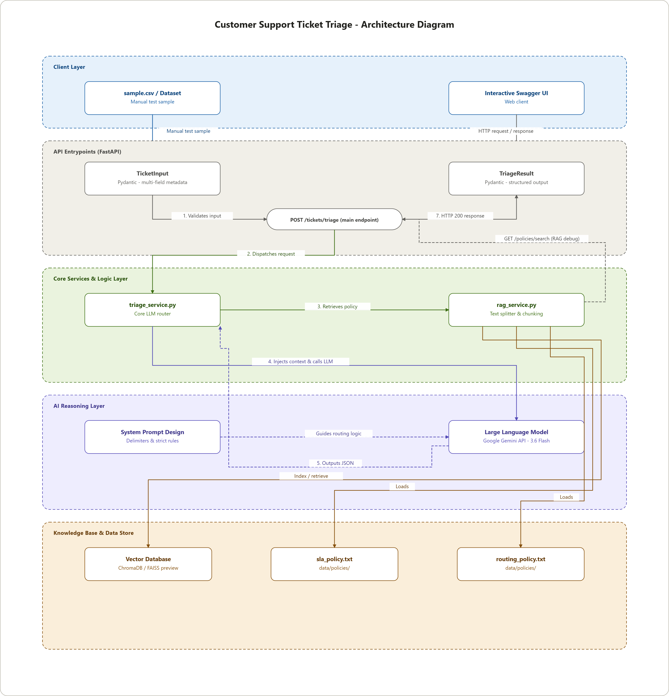

# Customer Support Ticket Triage

Customer Support Ticket Triage is an AI-powered backend service designed to classify incoming customer support tickets, ground reasoning in local Knowledge Base policies, and generate structured triage responses.

The system delivers an asynchronous, multi-agent Mixture-of-Experts (MoE) pipeline powered by Groq Cloud High-Speed Inference (`openai/gpt-oss-20b`), strict deterministic SLA enforcement, and a Grounding Judge Agent.

---

## Table of Contents

- [Overview](#overview)
- [Architecture](#architecture)
- [Specialist Agents & Routing Taxonomy](#specialist-agents--routing-taxonomy)
- [Features](#features)
- [Project Structure](#project-structure)
- [Workflow](#workflow)
- [Environment Configuration](#environment-configuration)
- [Repository Hygiene](#repository-hygiene)
- [Routing & Triage Design](#routing--triage-design)
- [API Endpoints](#api-endpoints)
- [Evaluation Benchmark](#evaluation-benchmark)
- [Sample Requests & Responses](#sample-requests--responses)
- [Running the Project](#running-the-project)
- [Current Limitations & Future Roadmap](#current-limitations--future-roadmap)
- [Authors](#authors)
- [License](#license)

---

## Overview

The system operates as a modular, high-throughput triage backend featuring:

- **FastAPI Asynchronous REST API:** Engineered for low-latency request handling and non-blocking worker concurrency.
- **Pydantic V2 Contract Validation:** Enforces strict payload verification for inbound tickets and outbound triage results.
- **Multi-Agent Mixture-of-Experts (MoE):** Intent Router with regular expression weighted signals directing tickets to dedicated domain specialists.
- **RAG Policy Ingestion & Citation Grounding:** Ingests local policy documents and attaches verifiable source citations to eliminate model hallucinations.
- **Deterministic SLA & Priority Engine:** Evaluates customer tiers and outage signals using rule-based overrides (P1–P4).
- **Judge Agent Grounding Verification:** Validates specialist citations against retrieved knowledge contexts.
- **Automated Offline Evaluation Harness:** Validates performance against the 30-case Full Gold Dataset (`data/gold_dataset.json`).

---

## Architecture

### System Architecture



### Multi-Agent Workflow (Mixture-of-Experts)

```text
                     [ Incoming Ticket / Batch ]
                                │
                                ▼
                   [ Multi-Domain Intent Router ]
                                │
   ┌───────────────┬────────────┼────────────┬───────────────┐
   ▼               ▼            ▼            ▼               ▼
[Technical]    [Billing]     [Refund]    [Account]      [Shipping]
[Security]     [Feedback]    [Other]
   │               │            │            │               │
   └───────────────┴────────────┼────────────┴───────────────┘
                                │
                                ▼
                 [ RAG Policy Grounding Context ]
             (data/policies/*.txt Policy Retrieval)
                                │
                                ▼
              [ Domain Specialist LLM Reasoning ]
                    (Groq: openai/gpt-oss-20b)
                                │
                                ▼
               [ SLA & Priority Scorer Engine ]
                 (P1-P4 Matrix & Outage Rules)
                                │
                                ▼
                      [ Judge Agent Guard ]
                 (Citation & Grounding Validator)
                                │
                                ▼
                   [ Validated TriageResult ]
```

---

## Specialist Agents & Routing Taxonomy

The system dynamically classifies tickets across 8 PRD-compliant domains:

- **Intent Router Agent:** Employs regex weighted pattern matching and context collision guards to delegate tickets to the appropriate specialist.
- **Technical Support Specialist:** Analyzes application bugs, crashes, outages, playback issues, and 500-series errors (`tech_support_queue`).
- **Billing Specialist:** Investigates recurring subscription disputes, invoice discrepancies, and double charges (`billing_default_queue`).
- **Refund Specialist:** Evaluates return payment eligibility and cancellation refund requests (`refund_expert_queue`).
- **Account Specialist:** Handles login authentication, OTP/2FA delivery failures, credential resets, and store access locks (`account_security_queue`).
- **Shipping & Logistics Specialist:** Tracks missing parcels, transit delays, and incorrect deliveries (`shipping_logistics_queue`).
- **Security Incident Specialist:** Investigates data breaches, phishing attempts, credential compromises, and unauthorized account access (`security_incident_queue`).
- **Customer Experience Feedback Agent:** Categorizes UI/UX suggestions, redesign feedback, and agent compliments (`customer_feedback_queue`).
- **General Support Agent:** Resolves general inquiries, store opening schedules, and unclassified questions (`general_triage_queue`).

---

## Features

- High-throughput asynchronous backend built with FastAPI.
- Multi-Agent MoE orchestration with deterministic SLA guardrails.
- Endpoints for single ticket triage (`/tickets/triage`) and parallel batch processing (`/tickets/triage/batch`).
- Deterministic P1 escalation engine targeting critical outages and enterprise tier disruptions.
- Grounding Judge Agent ensuring zero policy citation hallucinations.
- In-memory RAG policy retrieval engine with debug endpoint (`/policies/search`).
- Full Gold Dataset offline test harness (`evaluate.py`) tracking PRD compliance metrics.
- Interactive API documentation available via Swagger UI (`/docs`).

---

## Project Structure

```text
customer-support-ticket-triage/
│
├── app/
│   ├── api/
│   │   └── routes.py
│   │
│   ├── services/
│   │   ├── triage_service.py
│   │   └── rag_service.py
│   │
│   ├── schemas/
│   │   ├── ticket.py
│   │   └── triage.py
│   │
│   ├── config.py
│   └── main.py
│
├── data/
│   ├── policies/
│   │   ├── routing_policy.txt
│   │   ├── sla_policy.txt
│   │   ├── billing_policy.txt
│   │   ├── technical_policy.txt
│   │   └── macro_catalog.txt
│   │
│   ├── gold_dataset.json
│   └── sample.csv
│
├── docs/
│   ├── architecture-diagram.png
│   └── architecture_diagram.html
│
├── .env.example
├── .gitignore
├── evaluate.py
├── eval_report.md
├── requirements.txt
└── README.md
```

---

## Workflow

### 1. Single Ticket Triage Pipeline (`POST /tickets/triage`)

```text
Incoming Ticket Request (POST /tickets/triage)
                     │
                     ▼
Validate Input Schema (TicketInput via Pydantic)
                     │
                     ▼
Intent Router Agent (Regex Pattern Matching & Collision Guards)
                     │
                     ▼
RAG Policy Retrieval (rag_service.py pulls top relevant chunks)
                     │
                     ▼
Specialist Agent Reasoning (Groq API: openai/gpt-oss-20b)
                     │
                     ▼
Deterministic SLA Engine (Evaluates Customer Tier & P1-P4 Matrix)
                     │
                     ▼
Judge Agent (Verifies Citations against Knowledge Base Context)
                     │
                     ▼
Return Structured JSON Response (TriageResult)
```

### 2. Parallel Batch Processing Pipeline (`POST /tickets/triage/batch`)

```text
            Incoming Batch Request (BatchTicketInput)
                               │
                               ▼
        Asynchronous Worker Dispatcher (asyncio.gather)
        ┌──────────────────────┼──────────────────────┐
        ▼                      ▼                      ▼
 [Ticket 1 Triage]      [Ticket 2 Triage]      [Ticket N Triage]
        │                      │                      │
        └──────────────────────┼──────────────────────┘
                               │
                               ▼
            Aggregated Response (BatchTriageResult)
```

---

## Environment Configuration

Application settings and API credentials are kept separate from code logic using `python-dotenv`.

**`.env.example`**

```env
# Application Settings
APP_NAME="Customer Support Ticket Triage"
APP_ENV=development
APP_PORT=8000

# Inference Engine Configuration (Groq Cloud API)
GROQ_API_KEY=your_groq_api_key_here
MODEL_NAME=openai/gpt-oss-20b

# Logging Level
LOG_LEVEL=INFO
```

**Setup**

```bash
cp .env.example .env
```

Populate `.env` with your valid Groq API key (`gsk_...`). Configuration variables are loaded into the application context by `app/config.py`.

---

## Repository Hygiene

```text
data/
├── policies/
│   ├── routing_policy.txt
│   ├── sla_policy.txt
│   ├── billing_policy.txt
│   ├── technical_policy.txt
│   └── macro_catalog.txt
├── gold_dataset.json
└── sample.csv
```

The repository includes processed policy documents, macro response catalogs, a 30-case Ground Truth Gold Dataset, and customer tweet samples from the instructor data pack.

---

## Routing & Triage Design

### Priority & Escalation Matrix

| Priority | Criteria & Impact | Escalation | Target SLA |
|----------|-------------------|------------|------------|
| P1 | Enterprise customer, regional outage, or security data breach | Yes | Response within 1 hour |
| P2 | Pro customer or high-impact billing/technical disruption | No | Response within 4 hours |
| P3 | Free customer standard inquiries or shipping tracking | No | Response within 12 hours |
| P4 | Low-urgency product feedback or general policy questions | No | Response within 24 hours |

### Queue Routing Mapping

| Category | Assigned Queue | Policy Reference |
|----------|-----------------|-------------------|
| Technical | `tech_support_queue` | `technical_policy.txt`, `routing_policy.txt` |
| Billing | `billing_default_queue` | `billing_policy.txt`, `routing_policy.txt` |
| Refund | `refund_expert_queue` | `billing_policy.txt`, `routing_policy.txt` |
| Account | `account_security_queue` | `routing_policy.txt` |
| Shipping | `shipping_logistics_queue` | `routing_policy.txt` |
| Security | `security_incident_queue` | `technical_policy.txt`, `sla_policy.txt` |
| Feedback | `customer_feedback_queue` | `routing_policy.txt` |
| Other | `general_triage_queue` | `routing_policy.txt` |

---

## API Endpoints

1. **`POST /tickets/triage`** — Receives a single ticket payload and returns a validated triage classification.
2. **`POST /tickets/triage/batch`** — Processes multiple tickets in parallel using non-blocking worker pools (`asyncio.gather`).
3. **`GET /policies/search`** — Debug utility endpoint to inspect chunked retrieval contexts and test RAG query matching.

---

## Evaluation Benchmark

Offline evaluation executed via `python evaluate.py` across the Full Gold Dataset (30 cases):

| Metric | PRD Minimum Pass Threshold | Actual Score | Status |
|--------|------------------------------|---------------|--------|
| Category Accuracy | >= 85.0% | 96.7% (29/30) | PASSED |
| Priority Within 1-Level | >= 80.0% | 96.7% (29/30) | PASSED |
| Priority Exact Match | Informational | 66.7% (20/30) | Recorded |
| Queue Match Accuracy | Informational | 96.7% (29/30) | PASSED |
| Escalation Recall (TP) | 100.0% | 100.0% (7/7) | PERFECT |
| Average Response Latency | < 5.0s (Target) | 5.27s | Fast |

Refer to `eval_report.md` for detailed case-by-case analysis and failure mode breakdowns.

---

## Sample Requests & Responses

### Single Triage (`POST /tickets/triage`)

**Request Body (`TicketInput`)**

```json
{
  "subject": "System Outage - Payment Webhook Failure",
  "body": "Outage alert: Our checkout webhook endpoints are returning 500 error code. Critical disruption for all customers!",
  "customer_tier": "enterprise",
  "metadata": {
    "api_version": "v3",
    "region": "us-east-1"
  }
}
```

**Response Body (`TriageResult`)**

```json
{
  "category": "technical",
  "sub_intent": "outage_webhook_failure",
  "priority": "P1",
  "assigned_queue": "tech_support_queue",
  "industry": "technology",
  "suggested_macro_id": "macro_tech_system_outage",
  "internal_notes": "[TECHNICAL Expert]: Outage alert detected with 500 error codes. | Triggered P1/Escalation: Enterprise customer, outage, or security incident. | Verified by Judge Agent: Grounded with 2 policy source(s).",
  "policy_citations": [
    "technical_policy.txt",
    "sla_policy.txt"
  ],
  "confidence": 0.95,
  "escalate": true
}
```

---

## Running the Project

**1. Install Dependencies**

```bash
pip install -r requirements.txt
```

**2. Configure Environment**

```bash
cp .env.example .env
```

Add your Groq API Key to `.env`.

**3. Start the FastAPI Server**

```bash
uvicorn app.main:app --reload
```

**4. Run the Automated Evaluation Harness**

```bash
python evaluate.py
```

**5. Access Interactive Swagger Docs**

Open [http://127.0.0.1:8000/docs](http://127.0.0.1:8000/docs) in your browser.

---

## Current Limitations & Future Roadmap

- **Vector Search Engine:** Keyword chunk retrieval is currently used; vector embeddings (FAISS/ChromaDB) remain planned for production hardening.
- **Multilingual Support:** Current pattern dictionaries prioritize English support communications.
- **Agent Dashboard UI:** Frontend operational dashboard integration is scheduled for future milestone releases.

---

## Authors

**Group 4 — SCI19 3914 & SCI19 3934**

| Student ID | Name | Role |
|------------|------|------|
| B6722241 | นางสาวลลิตา ร่มลำดวน | Multi-Agent Orchestration & Evaluation |
| B6735036 | นายพัชรพล ลาภชุ่มศรี | Backend API & Data Validation |
| B6739324 | นายเจษฎา โพธิ์ราช | RAG Ingestion & Grounding Pipeline |
| B6739393 | นางสาวนิจจารีย์ ระดาบุตร | Data Annotation & Benchmark Analysis |

---

## License

This software was developed for academic evaluation purposes as part of the SCI19 3914 & SCI19 3934 curriculum.
